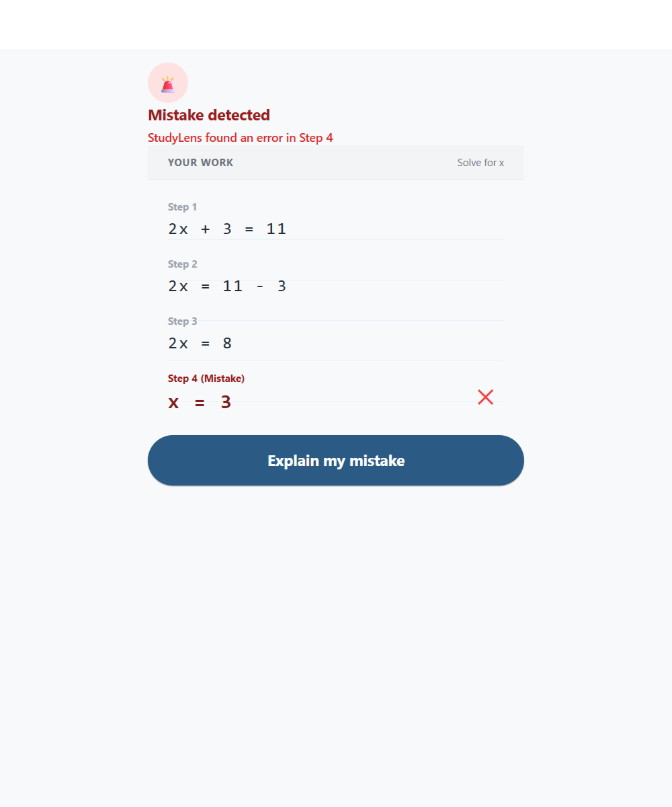
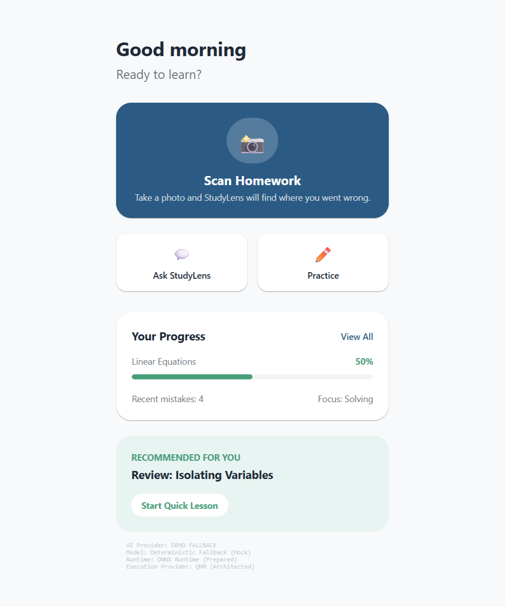
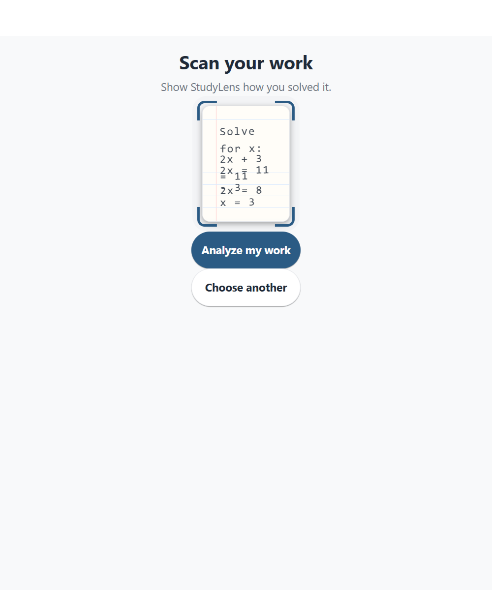
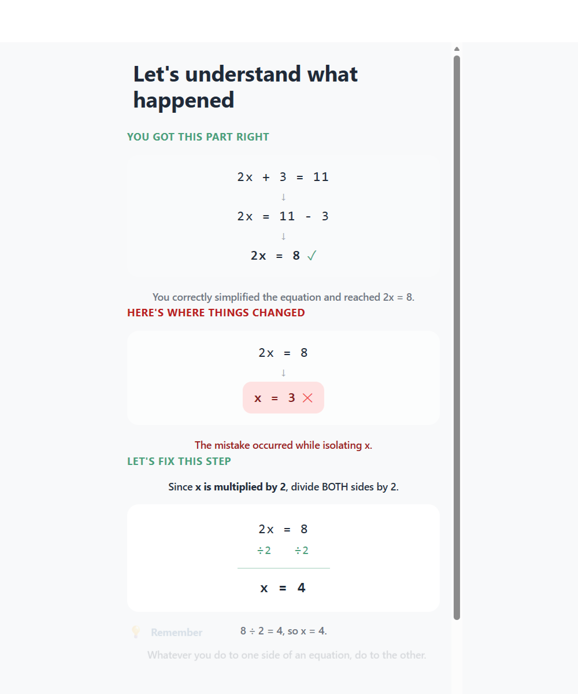
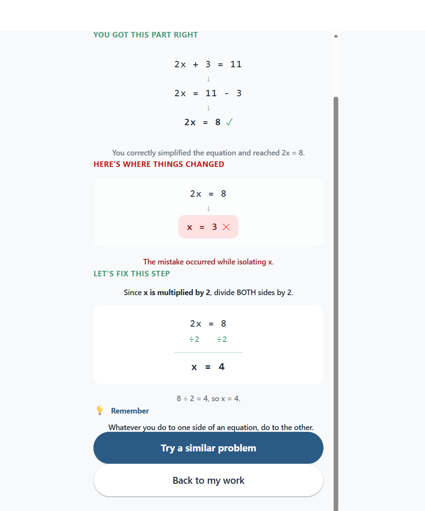
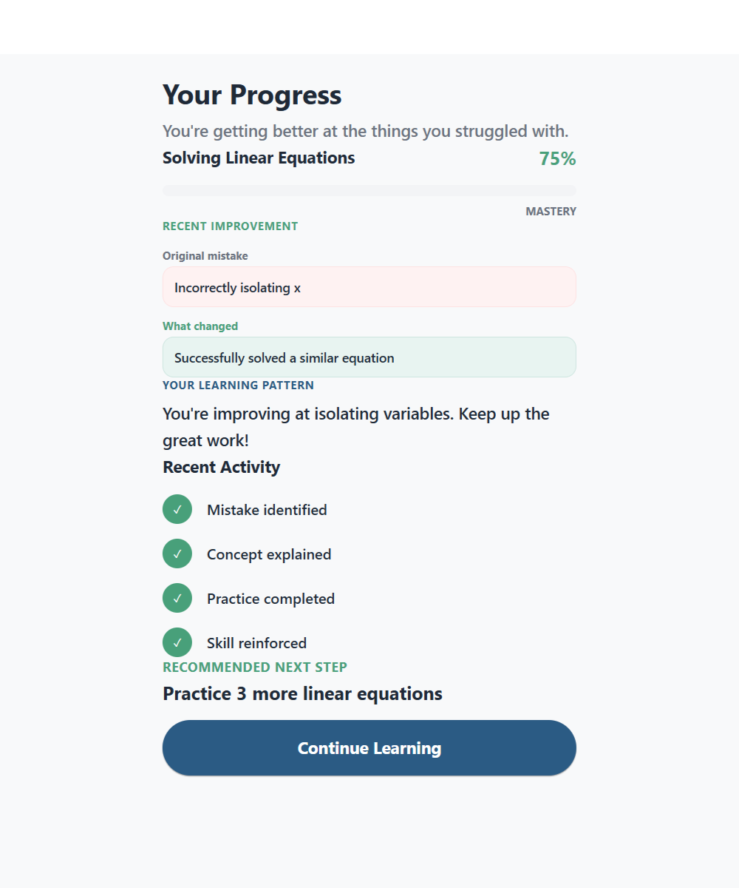

# StudyLens

**AI that sees how you learn.**

Student reasoning > final answer.

<div align="center">
  
</div>

StudyLens analyzes how a student solved a problem,
finds where their reasoning changed,
explains the mistake,
and turns it into targeted practice.

---

## Traditional Answer Checking VS StudyLens Reasoning Analysis

<table>
<tr>
<th align="center">TRADITIONAL</th>
<th align="center">STUDYLENS</th>
</tr>
<tr>
<td align="center">
Answer<br/>
&darr;<br/>
Correct / Incorrect
</td>
<td align="center">
Student Work<br/>
&darr;<br/>
Reasoning<br/>
&darr;<br/>
Exact Mistake<br/>
&darr;<br/>
Why?<br/>
&darr;<br/>
Practice<br/>
&darr;<br/>
Verified Improvement
</td>
</tr>
</table>

---

## One Mistake. One Learning Loop.

```text
2x + 3 = 11
2x = 11 - 3
2x = 8
x = 3
```

**DETECTED**
> Step 4

**CORRECT**
> 2x = 8
> /2   /2
> x = 4

**PRACTICE**
> 3x + 5 = 20
> x = 5

**MASTERY**
> 75%

---

## Product Preview

<table>
<tr>
<td align="center">
<br/>
<b>Dashboard</b>
</td>
<td align="center">
<br/>
<b>Scan</b>
</td>
<td align="center">
<br/>
<b>Mistake Detection</b>
</td>
</tr>
<tr>
<td align="center">
<br/>
<b>Explanation</b>
</td>
<td align="center">
<br/>
<b>Practice</b>
</td>
<td align="center">
<br/>
<b>Progress</b>
</td>
</tr>
</table>

---

## Technical Status

| Capability | Status |
| --- | --- |
| Core learning loop | **Implemented** |
| Scan experience | **Implemented** |
| Mistake visualization | **Implemented** |
| Step-by-step explanation | **Implemented** |
| Personalized practice | **Implemented** |
| Verification | **Implemented** |
| Progress tracking | **Implemented** |
| Deterministic offline demo | **Implemented** |
| Local AI abstraction | **Implemented** |
| ONNX Runtime architecture | *Prepared* |
| QNN execution | *Prepared / Not verified* |
| Snapdragon NPU inference | *Not verified* |
| Real handwriting OCR | *Not yet implemented* |
| Cloud AI API | *Not used* |

---

## On-Device AI Architecture

**Data Flow**
Student Work &rarr; Local Vision / OCR &rarr; Structured Mathematical Steps &rarr; Local Reasoning Model &rarr; Mistake Detection &rarr; Explanation &rarr; Targeted Practice &rarr; Progress

### Current Implementation:
- **IMPLEMENTED:** AI provider abstraction, `LocalAIProvider`, `DemoFallbackProvider`
- **PREPARED:** ONNX Runtime integration, QNN execution provider
- **NOT YET VERIFIED:** Actual Android QNN execution and Snapdragon NPU acceleration

---

## Why Local AI?

- Student work can remain on-device where practical, prioritizing privacy.
- No cloud dependency is required for the current deterministic demo.
- Native inference creates a path toward extremely low-latency educational feedback.
- Qualcomm/QNN hardware acceleration is a core architectural target for the final product.

*The current web prototype uses the deterministic fallback provider. Actual Android QNN/NPU execution has not yet been verified.*

---

## Built for the iQOO Hackathon

StudyLens leans heavily into themes central to the modern mobile ecosystem:
- **Phone-first learning**
- **On-device intelligence**
- **Local inference**
- **Potential NPU acceleration**
- **Real-time feedback**
- **Privacy-oriented architecture**

*(Note: Direct iQOO NPU integration is prepared architecturally but not yet verified in this prototype).*

---

## Run Locally

You can run the web prototype locally in less than a minute.

```bash
git clone https://github.com/FlameBLIZZard/STuDYleNS.git
cd STuDYleNS
npm install
npm start
```

Press `w` in the terminal to open the web prototype.

**Production Web Export:**
To generate the statically exported production build:
```bash
npx expo export -p web
```

---

## Running the native AI path

**Experimental / in development**

Executing the fully native ONNX/QNN pipeline requires a complete Android native toolchain:
- Android Studio & Android SDK
- JDK 17
- NDK (for C++ ML bindings)
- USB debugging for physical devices or a hardware-accelerated emulator
- Expo development build (prebuilding the native project)

*Note: Expo Go cannot load arbitrary native C++ ML bindings.*

**Intended commands:**
```bash
npx expo prebuild
npx expo run:android
```
*(These commands have not yet been successfully executed end-to-end on our current development machine due to environment constraints).*

---

## Demo Mode

To ensure a seamless, robust evaluation process, the prototype is equipped with a deterministic fallback provider. 

**Why it exists:**
- Reliable hackathon demonstration.
- Zero cloud dependencies or API keys required.
- No network requirement.
- A 100% consistent judging experience.
- Allows rapid UI and learning-loop development while the complex native ONNX inference is being integrated.

The developer indicator at the bottom of the Dashboard reports `AI Provider: DEMO FALLBACK` and does not falsely claim active QNN/NPU execution.

---

## Product Roadmap

- [x] Core learning loop
- [x] Scan experience
- [x] Mistake visualization
- [x] Step-by-step explanation
- [x] Personalized practice
- [x] Verification
- [x] Progress tracking
- [x] Local AI provider abstraction
- [x] Deterministic offline fallback
- [x] Vercel deployment configuration
- [ ] Real handwriting OCR
- [ ] Verified local ONNX inference on Android
- [ ] Verified QNN execution
- [ ] Verified Snapdragon NPU acceleration
- [ ] Broader subject support
- [ ] Expanded adaptive learning model

---

## Privacy

The intended architecture is local-first: student work should remain on-device wherever the implementation permits. 

**The current web prototype does not send homework to a cloud AI API.**

---

## Contributing / Development

- Keep AI providers strictly behind the `StudyLensAI` abstraction layer.
- Keep the `DemoFallbackProvider` perfectly reliable for web/offline testing.
- Do not introduce cloud AI dependencies without explicit architectural justification.
- Keep student data local where practical.
- Do not commit model binaries.
- Do not commit secrets.
- Use the existing Git workflow.

---

## License

This project is licensed under the MIT License - see the `LICENSE` file for details.

---

## Final Project Status

- **Status:** Competition-ready web prototype
- **Core learning loop:** Implemented
- **Web demo:** Deterministic / offline
- **Local AI architecture:** Prepared
- **Android native inference:** Not yet verified
- **QNN / NPU:** Not yet verified
- **Cloud AI:** Not used
